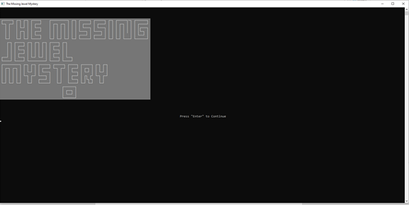
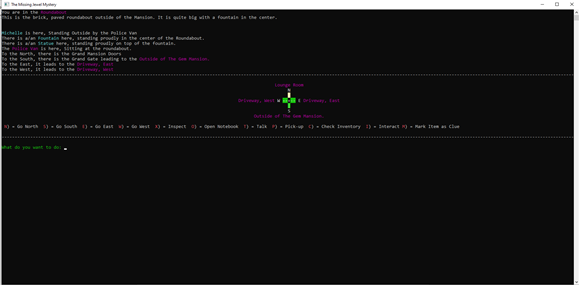
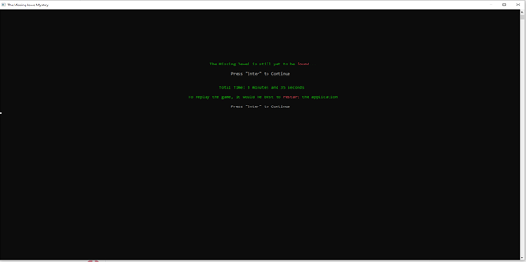

# Nehemiah Cedillo's Portfolio
A portfolio of Programming Creations.

This portfolio contains some of the programming experience and applications that I have created.

# Projects

## The Missing Jewel Mystery.
_This was a midterm project_

_Created on 11/8/2022_

_For Programming 101, Fall 2022 at Columbia Chicago College_

_Gameplay_

**Utilizing _[Basic writing and formatting syntax](https://docs.github.com/en/get-started/writing-on-github/getting-started-with-writing-and-formatting-on-github/basic-writing-and-formatting-syntax)_ for formatting in Github**
